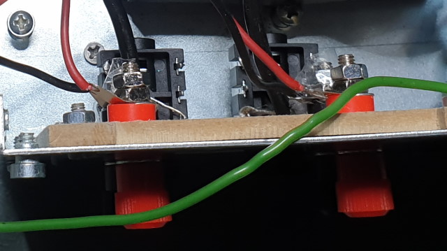
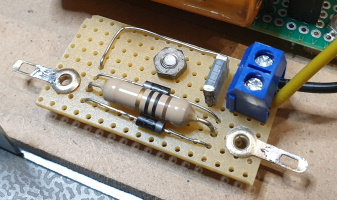

# DIY Dual TDA7293 Audio Power Amplifier

This project contains a DIY dual audio power amplifier to drive two 8 Ohm loudspeakers with unbalanced line input signals. The audio amplifier consists of a pre-assembled PCB based on a TDA7293 IC with minimal external components and is implemented in a various number of bass/guitar amps.

## Block diagram

I use the audio amplifier to drive both bass guitar and guitar loudspeakers at the same time with independent volume control for practicing at home. (See purple block in the block diagram below) [IK Multimedia Amplitube 5](https://www.ikmultimedia.com/products/amplitube5/?pkey=amplitube-5-max) bass/guitar emulation software is used to process the guitar sounds and emulate preamps and speakers. The TDA7293 amplifier drives loudspeakers in bass and guitar combo-amplifiers directly, so all electronics inside the orignal amps can be bypassed.

A bass and guitar should be connected to a high quality and low-latency audio interface. I use a [RME Fireface 802](https://www.rme-audio.de/fireface-802.html) via USB 2.0 with low-noise ADC's at 48kHz 64 samples buffer. In this setup, the latency is around 1.8ms. For 96kHz 96 samples the latency decreases to 1.3ms.

## DIY audio amplifier

I used an old computer power supply as case. It is compact, has good shielding and main power input connector and power switch are already present.

## Schematic

Please find the detailed schematic below.

## Downloads

* [TDA7293 datasheet .PDF](datasheets/TDA7293.pdf)
* [Kicad schematic .PDF](schematic/DualTDA7293PowerAmplifier.pdf)
* [Kicad schematic .SCH](kicad/DualTDA7293PowerAmplifier.sch)

## TDA7293 PCB

Technical specifications (according to the datasheet):

* Output power: 100Watt @ 8 Ohm
* Input voltage: Plus and minus 12V .. 50V DC
* Quiescent current: ~75mA
* Total harmonic distortion: 0.1% < 50W (f = 20 Hz to 15 kHz)
* Very low distortion
* Very low noise
* Thermal shutdown

The PCB comes from Aliexpress and is also available via Banggood, Ebay or other stores.

Note: Output power up to 10 Watt RMS per loudspeaker is more than sufficient for a practice bass/guitar amplifier! Your neighbors can confirm this. :-)

## Main input power

The 230V main power input connector `J1` and main switch `SW1A` are already present. However, there is no netfilter in my version and is not required. It is recommended to add a main fuse `F1`, but was not available in my PSU. The power switch is in series with the transformer to completely remove the power from the transformer.

## Transformer

Transformer `T1` should be a toroidal transformer type for minimum electromagnetic trayfield which reduses audio hum and noise. In my case I started with an existing 2x 15V AC 0.75A transformer which is sufficient for around 2x 10Watt RMS. Choose a 20V..35V AC / 30..50VAC transformer when more power is needed. Don't forget the conversion from AC to DC: `15VAC x sqw(2) = 15VAC x 1.41 = 21VDC`. The input voltage (positive and negative) may not exceed 50VDC.

## Rectifier power supply

In my case I noticed heavy 50Hz audio hum when connecting the transformer AC input directly to the amplifier PCB. The DC input voltage showed a ripple >250mV which is an indication of insufficient capacity of the input power 2200uF elco's. For this reason, I decided to manufacture a separate rectifier bridge and add two 2200uF elco's `C2` and `C3` on the input DC power. Small 100nF capacitors are already mounted on the amplifier PCB. An additional 0.5 Ohm `R2` and `R3` reduced additional ripple, but can be ommitted. Finally, the hum disappeared. 

The on-board rectifier brides are no longer needed as it is replaced with `D3`. For this reason I shortened the on-board rectifiers which is easier than desoldering. Solder wires (red lines) as shown in the picture below. 
With this modification a DC input voltage must be connected and not AC!

A high-effect orange power LED (`D4`, `R4`) can be optionally build-in the case which gives the look of a tube with glowing filament.

## Audio input

An unbalanced audio line output signal from a professional sound card should be connected to 6.3mm female TS (Tip-Sleeve) plugs `J1` and `J9` to the amplifier. The audio input can be shorten to ground when removing the TS plug to mute the amplifier. Most TS plugs have a built-in switch for this.

The volume can be controlled independent with two separate logarithmic potentiometers (`RV1`, `RV2`). Values 10k..100k will do the job by connecting one pin to ground, outer pin as audio input and moving pin to the audio input of the TDA7293 PCB.

The potentiometer case should be grounded correctly. This can be done by:
1. Mounting to the metal case, or:
2. Isolating from the case and connect to the ground pin.

It is recommended to use plastic knobs to avoid humm when touching a volume knob.

## Loudspeaker output

For the loudspeaker connectors I use red and black female banana plugs and must be isolated mounted in the metal case. They can be directly wired to the loudspeaker output of the PCB `J6` and `J14`.

## IC mounting

The TDA7293 IC must be isolated mounted to the metal case. Use a special mica isolation and nylon screw. Make sure the drill hole is smooth, because the metal side of the IC is the negative power voltage. My initial power supply burned out as a result of an invisible shortage between IC and metal case, so double check before power-up. 

The TDA7293 IC requires sufficient cooling as the chip becomes seriously hot under load. Optional heat paste can be used for improved cooling.

## Grounding

For safety reasons, the 0V wire of the transformer should be connected to the metal case which is indirectly the earth of the power main connector. There is a possibility to introduce a ground loop (and high current) when signal ground is connected to the main earth and for this reason there is a common protection network needed which consists of:
* 10 Ohm 5W resistor (`R1`)
* Two diodes (`D1`, `D2`)
* 100nF capacitor for noise filtering (`C1`)

I use small 1N4007 diodes, but some equipment uses heavy rectifier bridges to absorb high currents. In my setup I did not measure any current as everything is connected to the same main earth.

Note: The test-clips on the picture are optional and useful to hook-up a scope ground.

## Wiring

All low-signal audio input cables must be shielded to avoid external noise or cross talk. Avoid ground loops and it is better to create a single ground point, for example at 0V pin.

For minimal power loss, the internal wiring should be at least 0.5mm2 for:
* AC transformer wires (0.75mm2 recommended)
* DC power wires
* Loudspeaker wires

## Software setup DAW

The software setup in your DAW, in my case [REAPER](https://www.reaper.fm/) is as follows:

1. Create two audio tracks.
2. Select bass/guitar high inpedance inputs for each track and connect your guitar.
3. Insert AmpliTube 5 FX on both tracks and make sure audio input works.
4. Select hardware audio ouput for each track.
5. Now increase volume of the DIY amp.

A guitar and bass amp can be used at the same time as we have two independent loudspeakers:

The speaker emulation can be optionally disabled. This give a totally different sound. Also effects on the input or output for endless combinations.

## Questions

You can open an issue if you have any questions.

## Final words

Thanks for reading! I hope this is useful. I had several pitfalls related to hum, noise and black smoke burning the power supply and finally all addressed. The sound of the IK Multimedia pre-amps are amazing on real speakers. 

Please notice that there is currently only one amp on this planet manufactured by me. :-)
